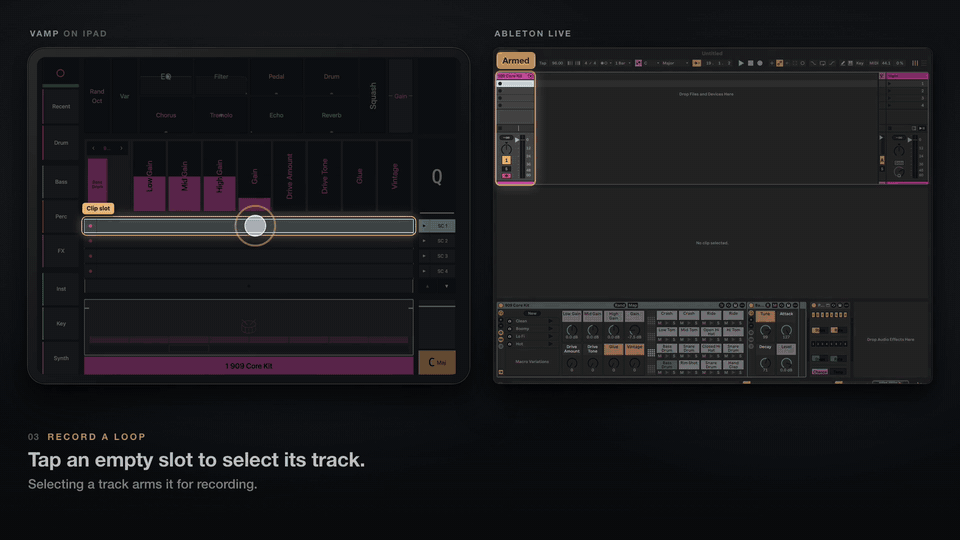
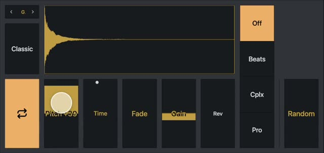
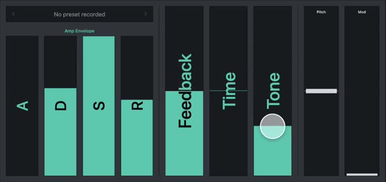
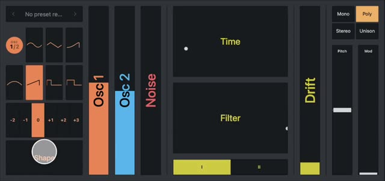
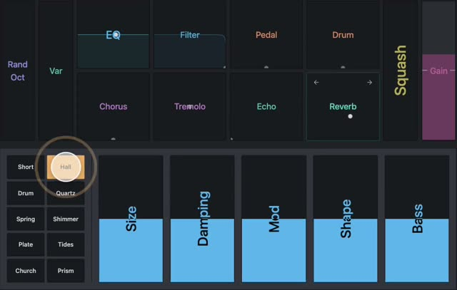

# Vamp

Live looping for Ableton Live, played from an iPad.

Vamp turns an iPad into a touch surface for performing with Live: record and launch loops, browse
and load instruments, shape sounds and effects, and sequence variations, without looking at the
laptop. It was built by a dance accompanist for playing ballet class and is shared as is.

There's no app to install and nothing from the App Store. Vamp is a web page served from the Mac
running Live: open it in Safari on the iPad over USB-C or Wi-Fi, or in a browser on the Mac itself.



[](LICENSE)

> **Status: released.** It runs every day on its author's rig and is ready for yours. A few tiles
> still expect the author's files (see [Known gaps](#known-gaps)).

## What it does

- **Tracks and clips.** Every track as a strip with its clip slots: record, launch, stop and
  overdub loops, with volume, mute and solo by touch. The selected track arms itself (Auto-Arm,
  in Settings). Group tracks fold.
- **A browser over Live's own library.** The Places in Live's sidebar, your User Library and
  your Packs, read from Live's index. Pick which ones show in Settings. A load lands on an empty
  track or a new one, colored by what it holds.
- **Instrument views.** Controls laid out per instrument: Simpler, Drum Rack (kit-wide controls
  that keep each pad's own tuning), Sampler, Operator, Drift, Wavetable and more, plus a pad grid.
- **Permute,** a step sequencer for each track that mutes and transposes what is playing, 16
  steps per lane, run by the control surface in time with Live.
- **On-screen pitch and mod wheels** for any MIDI track.
- **Capture:** record what you just played and turn it into a Simpler instrument.
- **Key detection:** Live's key follows the loops you are playing.
- **A foot switch,** any MIDI footswitch, taught with Learn in Settings.

<p>
  
  
  
  
</p>

**[Watch the five-minute walkthrough and a clip of every feature →](https://benjuodvalkis.com/other/vamp)**

## Requirements

- **macOS 13** or later
- **Ableton Live 12.4 Suite** (Max for Live is included in Suite)
- **Node.js 22.13** or later ([nodejs.org](https://nodejs.org/))
- An **iPad** with Safari, over USB-C or Wi-Fi. A Mac browser works too.

No third-party plug-ins and no special hardware are needed.

## Quick start

```bash
git clone https://github.com/ben-juodvalkis/vamp.git
cd vamp
npm run setup
```

Then, in Live:

1. **Settings → Link, Tempo & MIDI:** pick **Vamp** as a Control Surface, then quit and reopen
   Live.
2. In Live's browser, **Places → Add Folder…** and pick this checkout's `Vamp Devices` folder.

Then start it:

```bash
npm run dev
```

The first run opens **Settings** on the Mac as a checklist of what is left. For the iPad, use
`npm run ipad` and open the address Settings → Connection shows.
[INSTALLATION.md](INSTALLATION.md) has every step.

## How it fits together

```
iPad / browser  ⇄  bridge (WebSocket ⇄ OSC)  ⇄  control surface inside Live  ⇄  Live
  interface/        interface/bridge/                surface/
```

- **`interface/`**: the SvelteKit web app the iPad runs, and its server.
- **`interface/bridge/`**: the Node bridge between the page's WebSocket and the surface's OSC.
- **`surface/`**: a Python control surface Live loads as "Vamp". It does everything that touches
  Live.
- **`Vamp Devices/`**: the Max for Live devices the app loads for you (Permute, the wheels,
  Random Start, the recorder). It is the one folder you add to Live's sidebar.
- **`owner/`**: parts of the author's own rig (a macOS accessibility helper, a menu-bar app, a
  Max patch for the Ableton Move, test probes). They are switched off unless
  `config/constants.local.json` turns them on; nothing here needs them.
- **`docs/`**: `reference/` (architecture, the wire protocol, the feature switches),
  `plans/` and `adr/` (the decision records).

## Known gaps

- **Three effect tiles need the author's files.** Digital (a rack of Live devices), Pitch Hack and
  Chance (Max devices) load from the author's library, which doesn't ship yet; on another Mac
  they don't load. Every other effect tile inserts Live's own device, set up the way your Live
  defaults have it ([docs/plans/general-release/plan.md](docs/plans/general-release/plan.md)
  §6).
- **Some tiles are for the author's plug-ins** (Tremolo, Comb, Smudge, Bass, Pitch, Guitar) and do
  nothing without them.
- **Your network is trusted.** Anyone on the same network who can open the page can drive your
  Live set. Use the USB-C link or a network you trust. Device pairing is planned: see
  [SECURITY.md](SECURITY.md).

## Documentation

- [INSTALLATION.md](INSTALLATION.md): install, connect the iPad, troubleshoot
- [docs/reference/setup.md](docs/reference/setup.md): the details behind each setup step, and
  more troubleshooting
- [docs/reference/architecture.md](docs/reference/architecture.md): processes, ports and message
  flow
- [docs/reference/toggles.md](docs/reference/toggles.md): what each feature switch does
- [SECURITY.md](SECURITY.md): what your network can reach, playing safely, and reporting a
  vulnerability
- [CONTRIBUTING.md](CONTRIBUTING.md): working on the code

## License

MIT, © 2025–2026 Ben Juodvalkis. See [LICENSE](LICENSE) and
[THIRD-PARTY-NOTICES.md](THIRD-PARTY-NOTICES.md).
